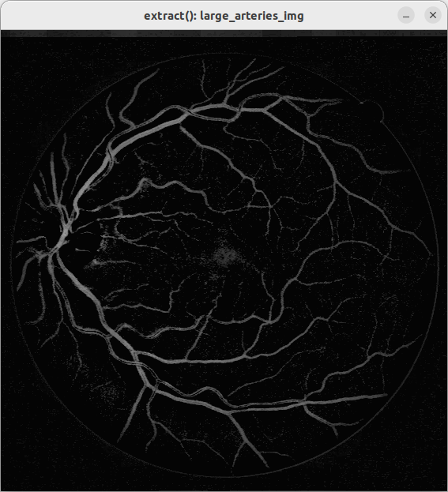

# Vessel Segmentation

Perform vessel segmentation using OpenCV with C++ as a capabilities demonstration. 

Implementation is based on [Contour Based Blood Vessel Segmentation in Digital Fundus Images](https://github.com/sachinmb27/Contour-Based-Blood-Vessel-Segmentation-in-Retinal-Fundus-Images/blob/main/CBBVS%20Documentation.pdf).  

The application, `vessel_segmentation`, accepts zero or more input images along with corresponding output image names in pairs, e.g.:  
`vessel_segmentation input1.tif output1.tif input2.tif output2.tif`


Segmentation is performed using:  
 1. Contrast Limited Adaptive Histogram Equalization  
 1. thresholding  
 1. morphological operations  
 1. median filtering  
 1. blob rejection based on blob geometric characteristics.  

# Building
To build the software:
 Clone the repo. Inside the repo, perform the following command:

 1. `mkdir build`
 1. `cd build`
 1. `cmake ..`
 1. `make`

This results in an executable `build/vessel_segmentation`. 

# Running
From the `build` directory, you can run with the test files as:
## Help
`./vessel_segmentation -h` for help
```./vessel_segmentation [-h] [-s] [<input_img> <output_img>]*
        -h : print help
        -s : show images. Press 'q', SPACE, or ESC to close window.
        <input_img> input image that is read and processed.
        <output_img> path where output image is written
```


## Run once image with intermediate results shown on-screen
`./vessel_segmentation  -s ../drive/DRIVE/test/images/01_test.tif 01.tif` to show intermediate result on-screen.  

  

  

  


## Run all tests, overwriting test results in repo
`for i in {1..18}; do ./vessel_segmentation  ../drive/DRIVE/test/images/$(printf %02d $i)_test.tif ../output/$(printf %02d $i).png; echo $i; done`

Yields the following images (truncated to the first 8):  

  

  

  

  

  

  

  

  
